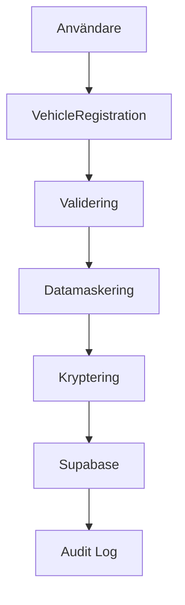
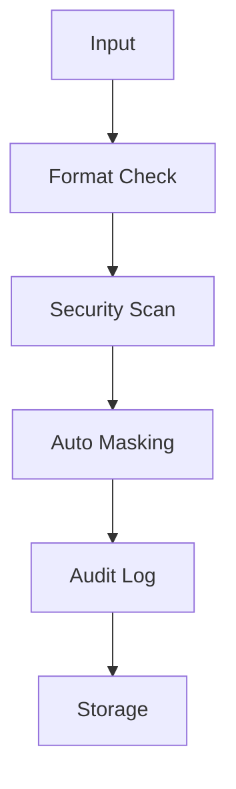

# CaiZen - Teknisk Arkitektur

## Säkerhetsarkitektur

### Privacy by Design

- **Tvådelad databas** (encrypted/masked)
- **Row Level Security** med Supabase
- **Automatisk datamaskering** av känsliga identifierare
- **GDPR-kompatibel** från grunden

### Datamaskering

All känslig fordonsdata maskeras automatiskt:

```typescript
// Registreringsnummer: ABC123 → ABC***
// VIN: WBA3A5G59DNP26082 → WBA***********6082
// Personnummer: 19901201-1234 → 199012**-****
```

## Tech Stack

### Frontend

- **React 19** med TypeScript
- **TailwindCSS** för styling
- **Lucide React** för ikoner
- **Framer Motion** för animationer

### Backend & Database

- **Supabase** (PostgreSQL, Auth, Storage)
- **Row Level Security** för data isolation
- **Real-time subscriptions** för live updates

### Maps & Geografi

- **Leaflet/OpenStreetMap** för kartor
- **Geografisk sökning** för marknadsplats
- **Privacy-safe location** (endast region, inte exakt adress)

### OCR & Dokumenthantering

- **Tesseract.js** för OCR
- **Automatisk dokumentklassificering**
- **Smart data extraction** med säkerhetskontroller

## Komponentsystem

### Modular Design

```
src/components/
├── common/       # Återanvändbara komponenter
├── vehicle/      # Fordonshantering
├── marketplace/  # Marknadsplats
├── security/     # Säkerhetskomponenter
└── ocr/         # Dokumenthantering
```

### Security Layer

```
src/lib/security/
├── dataMasking.ts    # Automatisk datamaskering
├── encryption.ts    # Kryptering/dekryptering
└── validation.ts    # Säker validering
```

## Privacy by Design Principles

### 1. Proactive not Reactive

- Säkerhet inbyggt från dag 1
- Automatiska säkerhetskontroller
- Pre-commit hooks förhindrar läckage

### 2. Privacy as the Default

- All känslig data maskeras automatiskt
- Opt-in för datadelning
- Minimal data collection

### 3. Privacy Embedded into Design

- Ingen känslig data i frontend
- Krypterad lagring
- Audit logging för all åtkomst

### 4. Full Functionality

- Säkerhet utan funktionsförlust
- Användarvänlig privacy
- Transparent datapolicies

### 5. End-to-End Security

- Säker hela dataflödet
- Krypterad transport
- Säker datalagring

### 6. Visibility and Transparency

- Tydliga privacy settings
- Synlig datamaskering
- Audit logs för användare

### 7. Respect for User Privacy

- Användaren äger sin data
- GDPR-kompatibel från grunden
- Enkla export/delete funktioner

## Dataflöde

### Fordonsregistrering



### Säkerhetsvalidering



## Performance

### Frontend

- **Code splitting** för snabb laddning
- **Lazy loading** av komponenter
- **Optimerade bilder** och assets

### Backend

- **Effektiva queries** med Supabase
- **Caching strategies** för ofta använd data
- **Rate limiting** för API-säkerhet

## Monitoring & Analytics

### Säkerhetsmonitoring

- **Real-time security alerts**
- **Audit log analysis**
- **Automatic threat detection**

### Performance Monitoring

- **Core Web Vitals** tracking
- **Error monitoring** med Sentry
- **Usage analytics** (anonymized)

## Deployment

### Staging Environment

- **Vercel Preview** för PR reviews
- **Automated testing** på deploy
- **Security scanning** i CI/CD

### Production

- **Vercel Production** med global CDN
- **Supabase Production** med backups
- **Domain security** med HTTPS/HSTS
